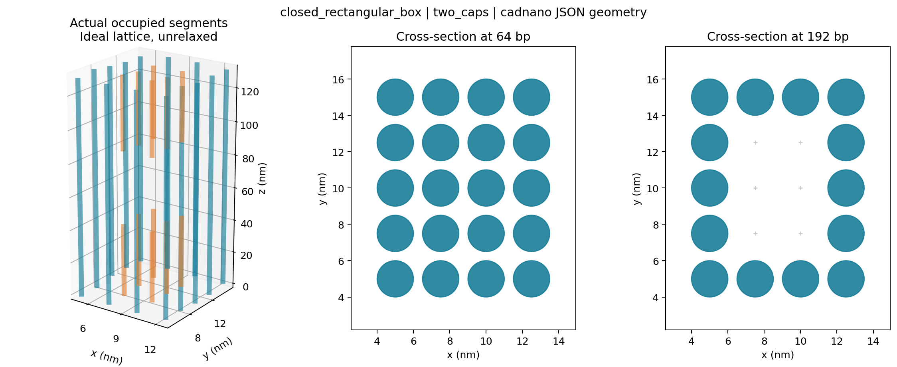
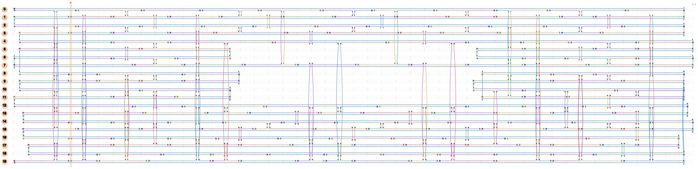

# V3.0.0 验证记录

日期：2026-09-17。

发布测试覆盖 36 个设计，每个设计均验证 full 与 compact，共完成 72 次 cadnano 原生导入、交叉位点核验和连接数组往返比较，全部通过。具体参数与计数见 [release-results.json](examples/release-results.json)。

生成环境：Python 3.13、scadnano 0.20.1。独立原生核验环境：Python 3.9.23、cadnano2 2.4.13、PyQt6 6.4.2。

## 覆盖范围

- 原有 8 个 V2 模板全部保留并通过原生核验。
- 新增 9 个入口的默认参数全部通过。
- square 近圆管的 8/12/16/24/32 螺旋、honeycomb 近圆管的 6/18/24/32 螺旋。
- 两种晶格的 8/16/24 螺旋束，以及默认 12 螺旋束。
- 方形、矩形的单端盖与双端盖，参数化矩形双盖、近圆入口的 12 螺旋双盖。
- honeycomb 30 螺旋六边形壳。

两份测试程序共 24 个测试方法，包含多组参数子测试。失败测试覆盖奇数闭环、不兼容晶格、错误边数、矛盾尺寸、盖厚/长度冲突、预算不足、不可行路径、端盖缺损、空腔堵塞、错误坐标、断链、交叉相位偏移、非互反引用、compact 字段丢失和覆盖保护。

## 证据的含义

原生检查器不导入本项目晶格表；它调用 cadnano 自身的 decoder、邻接和 crossover 表以及 encoder。scaffold/staple 长度列表与交叉数量也与本地验证器逐项一致。所有测试生成结构的 scaffold 均为一条连续线性寡核苷酸。

固定端盖检查直接读取实际 JSON 占用，确认内部列在盖面处存在、中段空腔无占用，并验证管壁与端盖接触的 staple 连接。单纯 JSON 语法正确不会通过这些验收。

生成的 [封闭长方体](examples/closed_rectangular_box.full.json) 与 [蜂窝近圆管](examples/round24_honeycomb.full.json) 可直接在 cadnano 打开。

上图是 JSON 中真实螺旋占用的理想晶格图：端部内部列填满，中间留空。不是 CanDo 或 oxDNA 的松弛结果。

原生 Path View 图片由 cadnano 的场景离屏渲染；并非人工桌面点击验收。

## 明确限制

这是组合拓扑、晶格几何和文件兼容性验证，不能证明折叠过程不会缠结、最终三维形状精确、端盖液密、CanDo 收敛或实验稳定。固定盖为有厚度的平行螺旋填充块，不能当作薄片铰链盒。三角截面和任意多边形没有实现；有限搜索失败也不能证明其他算法绝无解。

复现：运行 README 中的 test_design.py、test_v3.py，以及独立环境中的 check_cadnano.py。新增模板参数和精确占用数据见对应 report.json。
