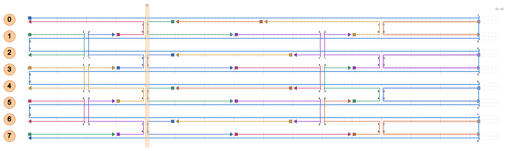
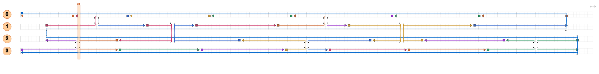

# V2.0.0 发布验证

验证日期：2026-09-15。结论：本次覆盖的 15 个设计均通过本地结构检查及 cadnano 原生导入、晶格交叉位点检查和连接数组往返核验。不是对任意参数、CanDo 模拟或实验折叠成功的保证。

## 环境与方法

- 生成与回归：Python 3.13、scadnano 0.20.1。
- 独立核验：Python 3.9.23、cadnano2 2.4.13、PyQt6 6.4.2。
- `scripts/check_cadnano.py` 使用 cadnano 自己的邻接和 crossover 表，不导入本项目的规则表或验证器。
- `examples/release-check-results.json` 保存计数和结果。负例的 `FAIL` 表示旧错误结构被成功拦截，不代表第二版测试失败。

## 结果

| 检查 | 结果 |
|---|---|
| 回归测试 | 15 个测试方法全部通过，包含多组正例和损坏输入子测试 |
| 8 个已实现模板的默认参数 | 全部通过 |
| 蜂窝矩形、square 晶格的 2/4/6 螺旋束 | 全部通过 |
| 奇数螺旋矩形、两种晶格的 672 bp 边界 | 全部通过 |
| 15 个设计的 full 和 compact | 共 30 次 cadnano 原生核验全部通过 |
| 原生链长、链数、交叉数与本地验证器比较 | 全部一致 |
| 第一版矩形及四螺旋束错误样本 | 均被第二版拒绝 |
| 矩形与四螺旋束原生 Path View 渲染 | 已生成并检查，见下方图片 |

回归覆盖错误邻接、交叉相位整体偏移、断开的 scaffold、非互反引用、非法方向、无效数组及颜色、插入/删除、非连续 helix 编号、全部字段 compact 比较、参数矛盾、未实现形状、已有文件保护和失败不交付。

## 可查看的证据

- [矩形 JSON](examples/rectangle.full.json) / [原生核验](examples/rectangle.native.json)
- [四螺旋束 JSON](examples/4_helix_bundle.full.json) / [原生核验](examples/4_helix_bundle.native.json)

以下图片是 cadnano 原生场景的离屏渲染，并非另画的示意图。为离屏文字显示加载了 Arial；没有改动 DNA 模型。未进行人工桌面点击验收。





## 复现

在本目录安装 `requirements.txt` 后执行：

```sh
python scripts/test_design.py
python scripts/template_design.py 4_helix_bundle -o output/verify4
```

在已安装上述 cadnano2/PyQt6 的独立环境中执行：

```sh
python scripts/check_cadnano.py output/verify4.full.json --lattice honeycomb
python scripts/check_cadnano.py output/verify4.cando_compact.json --lattice honeycomb
```

生成器只在自己的结构约束全部满足时交付输出。cadnano 能读取并显示且交叉位点合法，不等价于三维形状或实验稳定性已获证明；本次没有向 CanDo 上传文件。
